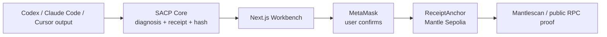

# Agent Flight Recorder

> Codex says "done." Agent Flight Recorder makes it prove it.

Agent Flight Recorder is an AI DevTools audit layer for Codex, Claude Code, Cursor-style coding agents, and other autonomous developer workflows. It turns an agent's messy "done / tested / deployed" claim into a structured SACP receipt, hashes it, anchors the receipt hash on Mantle, and gives judges a public explorer proof.

```text
agent claim
-> SACP diagnosis
-> structured receipt
-> canonical receipt hash
-> Mantle Sepolia anchor
-> explorer / RPC verification
```

Core principle:

```text
No receipt, no trust.
```

## Judge Links

| Item | Link |
| --- | --- |
| Live demo | https://agent-flight-recorder-mantle.vercel.app |
| GitHub repo | https://github.com/aDragon0707/agent-flight-recorder-mantle |
| DoraHacks BUIDL | https://dorahacks.io/buidl/43870 |
| Demo video | https://youtu.be/SfBEMzkSDUM |
| ReceiptAnchor contract | https://sepolia.mantlescan.xyz/address/0x69E07961d8c022B81c1c968ef7C1a3955E8D182b |
| Sample anchor transaction | https://sepolia.mantlescan.xyz/tx/0x0aea4a4f414551d0f4d45685240285795f6f8b81c89976db572477f752b877cb |
| Submission evidence | docs/evidence/009-submission-package.md |
| Public demo evidence | docs/evidence/008-public-demo-deploy.md |
| Explorer verification evidence | docs/evidence/007-explorer-verification.md |

## Judge Demo In 2 Minutes

1. Open the live demo.
2. Pick a sample agent output that claims work is done without enough evidence.
3. Read the SACP diagnosis: status, risk, findings, required fix, and next owner.
4. Inspect the generated SACP receipt and deterministic receipt hash.
5. Connect MetaMask on Mantle Sepolia.
6. Anchor the receipt hash through `ReceiptAnchor`.
7. Open Mantlescan and verify the emitted `ReceiptAnchored` event.

The demo does not upload private agent logs. The full receipt stays off-chain; only the hash and minimal audit metadata are written to Mantle.

## Why AI DevTools

AI coding agents can produce fluent completion claims that hide uncertainty:

- "Done" without tests.
- "Deployed" without a URL.
- "Safe to proceed" after crossing a human-approval boundary.
- "Fixed" without a reproducible receipt.

Agent Flight Recorder gives those claims a verifiable workflow. It is not another chat UI; it is a receipt layer for agent work. The user can ask: "Where is the receipt?" and then verify that receipt on-chain.

## Why Mantle

Mantle is used as the public audit anchor:

- Cheap enough for demo-scale receipt anchoring.
- Public enough for judges to verify via Mantlescan.
- Neutral enough that the app does not need a backend database to prove that a receipt existed.
- Fits the Turing Test theme: AI work should leave inspectable evidence, not only confident language.

## Verified On-Chain Evidence

```text
Network: Mantle Sepolia
Chain ID: 5003
ReceiptAnchor: 0x69E07961d8c022B81c1c968ef7C1a3955E8D182b
Deploy tx: 0x3b7be838fe7384cb37d5ea8dfb49c6ea2788c7766158999834473625fce6568f
Sample anchor tx: 0x0aea4a4f414551d0f4d45685240285795f6f8b81c89976db572477f752b877cb
```

The sample transaction was independently checked through public Mantle Sepolia RPC in `007-explorer-verification`. The decoded event matches the recorded receipt hash, agent ID hash, task ID hash, status code, submitter, and timestamp.

## Architecture



Trust boundary:

```text
Raw agent log: browser only
Full receipt JSON: off-chain
Receipt hash + status metadata: on-chain
Wallet credentials: never in repo, never in frontend
```

## Tech Stack

| Layer | Technology |
| --- | --- |
| Frontend | Next.js App Router, React, TypeScript, Tailwind CSS |
| Core receipt logic | `packages/sacp-core`, pure TypeScript |
| Wallet / chain calls | MetaMask injected provider, viem |
| Smart contract | Solidity, Hardhat, `ReceiptAnchor.sol` |
| Network | Mantle Sepolia |
| Deployment | Vercel |
| Governance | specs, task board, evidence ledgers, PowerShell verify gates, GitHub Actions |

## What Is Implemented

- Rule-based SACP diagnosis for messy agent outputs.
- Deterministic SACP receipt creation and canonical receipt hashing.
- MetaMask wallet detection and connection.
- Mantle Sepolia network check and switch.
- `ReceiptAnchor` deployment on Mantle Sepolia.
- Real wallet-based anchor transaction.
- Mantle Explorer / public RPC verification.
- Public Vercel demo deployment.
- Demo video and DoraHacks BUIDL submission package.
- Evidence ledgers for specs `000-009`.

The earlier scaffold stage remains recorded in the evidence history for audit continuity; the project is now a public demo MVP.

## Repository Structure

```text
agent-flight-recorder-mantle/
  apps/web                 Next.js public demo
  packages/sacp-core       diagnosis, receipt, canonicalization, hashing
  contracts                ReceiptAnchor Solidity + Hardhat
  docs                     PRD, architecture, evidence, submission docs
  specs                    task graph, status, task board
```

## Local Development

This project uses `pnpm` through Corepack.

```powershell
corepack prepare pnpm@10 --activate
corepack pnpm install
corepack pnpm test
corepack pnpm build
```

Useful commands:

```bash
corepack pnpm dev
corepack pnpm lint
corepack pnpm typecheck
corepack pnpm test
corepack pnpm build
corepack pnpm progress
corepack pnpm verify:all
```

## Documentation

- [PRD v0.1](docs/prd.md)
- [Engineering Workflow](docs/engineering.md)
- [Architecture v0.1](docs/architecture.md)
- [Submission Readiness Audit](docs/submission-readiness-audit.md)
- [Demo Script](docs/demo-script.md)
- [Submission Checklist](docs/submission-checklist.md)
- [Project Acceptance Ledger](docs/project-acceptance.md)
- [Handoff](docs/handoff.md)

## Security Boundary

Never commit:

- wallet private keys
- seed phrases
- wallet passwords
- API keys
- cookies, tokens, or sessions

The MVP does not store private agent logs on-chain. On-chain data is limited to:

- `receiptHash`
- `statusCode`
- `agentIdHash`
- `taskIdHash`
- `submitter`
- `timestamp`
