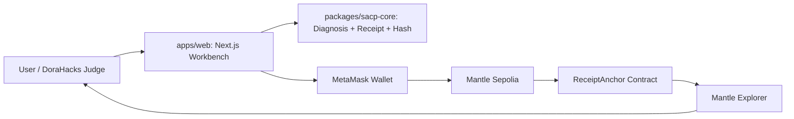
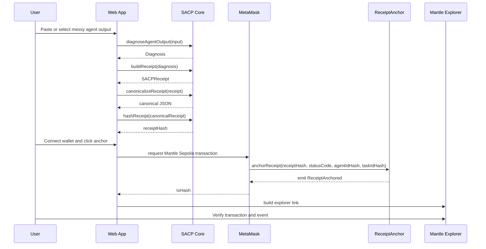
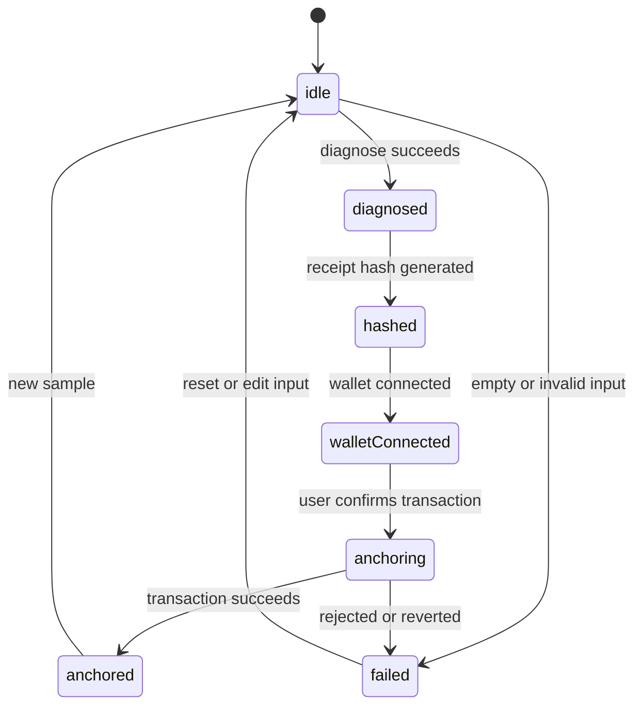

# Agent Flight Recorder Architecture v0.1

## 1. Architecture Goal

本文档定义 `Agent Flight Recorder` 的 MVP 架构。它只服务 DoraHacks The Turing Test Hackathon 2026 的可提交版本，不扩展成完整 AgentOps 平台。

架构主线必须支持这个闭环：

```text
messy agent output
-> SACP 规则诊断
-> SACP receipt
-> receipt hash
-> Mantle Sepolia anchor
-> explorer verification
```

优先级：

- 第一优先级：评委能在 2-5 分钟内看懂并跑完整 demo。
- 第二优先级：开发者能按模块边界实现、测试和部署。
- 第三优先级：后续能自然扩展到 LLM diagnosis、后端 API 或 agent reputation。

本架构明确不做：

- 用户账号系统。
- 数据库。
- 完整后端服务。
- IPFS。
- Mantle mainnet。
- 链上 AI 推理。
- 完整 AgentOps 平台。

正确边界：

```text
AI/SACP diagnosis runs off-chain.
The verifiable diagnosis result hash is written on-chain.
```

### Implementation Status

本小节只记录当前工程实现状态，不扩大架构范围。

- [x] Root `pnpm workspace` scaffold 已完成。
- [x] `packages/sacp-core` 已实现最小接口与测试。
- [x] `apps/web` 已实现三列 workbench shell。
- [x] `contracts` 已实现 `ReceiptAnchor.sol` 与基础测试。
- [x] root `lint`、`typecheck`、`test`、`build` 已通过。
- [x] Governance gate files 已加入，包括 specs、evidence、CI、verify scripts。
- [x] Verified foundation spec: `000-scaffold`。
- [x] Verified wallet detection spec: `001-wallet-detection`。`apps/web` 只读取 injected `window.ethereum` 是否存在，并显示 detected / not detected；不连接钱包、不切网络、不发交易。
- [x] Verified wallet connect spec: `002-wallet-connect`。`apps/web` 只在用户点击 `Connect wallet` 后调用 `eth_requestAccounts`，并显示 connected / rejected / failed 状态；不检查网络、不切网络、不发交易、不持久化地址。
- [x] Verified Mantle network check spec: `003-mantle-network-check`。`apps/web` 只在钱包 connected 后由用户点击 `Check network` 调用 `eth_chainId`，大小写不敏感判断 `0x138b` / Mantle Sepolia，并显示当前 chain id；不切网络、不发交易、不调用合约、不持久化、不注册钱包事件监听。
- [x] Verified Mantle network switch spec: `004-mantle-network-switch`。`apps/web` 只在钱包 connected 且网络检查为 `wrong_network` 后显示 `Switch to Mantle Sepolia`，用户点击后调用 `wallet_switchEthereumChain` 和 `0x138b`；`4001` 显示 rejected，`4902` 显示 not added，不自动添加网络，不发交易、不调用合约、不部署。
- [x] Verified contract deploy spec: `005-contract-deploy`。`ReceiptAnchor` 已部署到 Mantle Sepolia（chainId 5003），地址 `0x69E07961d8c022B81c1c968ef7C1a3955E8D182b`，deploy tx `0x3b7be838fe7384cb37d5ea8dfb49c6ea2788c7766158999834473625fce6568f`；单次真实部署，未调用 `anchorReceipt`、未发前端交易、未做公开 demo 部署。
- [~] Implemented anchor transaction spec: `006-anchor-transaction`（006A，仅代码）。`apps/web` 在 `Mantle Anchor` 面板新增 `Anchor receipt` 按钮，仅当 receipt 与 receiptHash 存在、钱包 connected、网络为 `mantle_sepolia` 时启用；点击后由 `apps/web/lib/anchor-receipt.ts` 用 viem 编码 `anchorReceipt(receiptHash, statusCode, agentIdHash, taskIdHash)` 并经注入式 provider `eth_sendTransaction` 发送，`agentIdHash`/`taskIdHash` 为 `keccak256(toBytes(agentId|taskId))`，合约地址常量在 `apps/web/lib/chains.ts`。UI 状态：idle / anchoring / anchored（显示 tx hash 与 Mantlescan 链接）/ rejected（4001）/ failed。状态为 `implemented`，未发真实交易、无真实 tx hash，未做浏览器验证。
- [ ] `apps/web` 尚未接真实 MetaMask transaction。
- [x] `ReceiptAnchor` 已部署到 Mantle Sepolia（`005-contract-deploy`）。
- [ ] README 尚未包含 deployed contract address、demo URL、explorer link。
- [ ] DoraHacks submission materials 尚未完成。

## 2. System Context

MVP 由四个核心部分组成：

- `apps/web`：公开前端 demo，负责三列工作台、钱包连接、合约调用和状态展示。
- `packages/sacp-core`：浏览器安全的 TypeScript 纯函数包，负责诊断、receipt、canonicalization 和 hash。
- `contracts`：`ReceiptAnchor.sol` 与 Hardhat deploy / verify / test。
- Mantle Sepolia：保存 receipt hash 和最小审计元数据，并通过 Mantle Explorer 供评委验证。



系统信任边界：

- 原始 agent output 只在浏览器中处理，MVP 不上传后端。
- full receipt JSON 默认不上链。
- 链上只保存 `receiptHash`、`statusCode`、`agentIdHash`、`taskIdHash`、`submitter`、`timestamp`。
- 私钥只用于本地合约部署，不进入前端和仓库。

## 3. End-to-End Flow



失败路径必须在 UI 中明确显示：

- 空输入：不能运行诊断。
- 无法生成 receipt：显示 diagnosis error。
- 钱包未连接：禁止 anchor。
- 错误网络：提示切换到 Mantle Sepolia。
- 用户拒绝交易：显示 rejected 状态。
- 交易失败：显示 failed 状态和可复制错误。

## 4. Module Boundaries

### 4.1 `apps/web`

职责：

- 三列工作台 UI。
- demo sample selector。
- 调用 `packages/sacp-core`。
- 显示 diagnosis、receipt、hash。
- 连接 MetaMask。
- 检查 Mantle Sepolia 网络。
- 调用 `ReceiptAnchor` 合约。
- 显示 tx hash、contract address、explorer link。

不负责：

- 保存用户账号。
- 保存历史 receipt。
- 执行合约部署。
- 读取或保存私钥。
- 运行服务端 LLM diagnosis。

建议技术：

- `Next.js App Router`
- `TypeScript`
- `Tailwind CSS`
- `wagmi`
- `viem`

### 4.2 `packages/sacp-core`

职责：

- 规则诊断。
- 构建 SACP receipt。
- 稳定 JSON canonicalization。
- receipt hash 生成。
- demo samples 和测试 fixtures。

不负责：

- React UI。
- 钱包连接。
- 合约调用。
- 浏览器存储。
- 网络请求。

设计原则：

- 所有核心函数应为纯函数。
- 输入输出应可测试、可快照、可复用。
- 不依赖 DOM。
- 不依赖 OpenAI API。

### 4.3 `contracts`

职责：

- `ReceiptAnchor.sol`。
- 合约测试。
- Hardhat deploy script。
- Hardhat verify script。
- Mantle Sepolia 配置。

不负责：

- 存储 full receipt JSON。
- 存储原始 agent log。
- 判断 receipt 是否正确。
- 执行 AI 推理。

### 4.4 `docs`

职责：

- `prd.md`：产品需求来源。
- `engineering.md`：工程治理来源。
- `architecture.md`：工程架构来源。
- `demo-script.md`：演示脚本。
- `submission-checklist.md`：提交检查清单。

## 5. Data Contracts

### 5.1 `Diagnosis`

```ts
type StatusCode =
  | "PASS_WITH_EVIDENCE"
  | "NEEDS_EVIDENCE"
  | "NEEDS_HUMAN_REVIEW"
  | "BLOCKED_UNSAFE_MEMORY"
  | "STALE_OR_DUPLICATE_HANDOFF";

type RiskLevel = "low" | "medium" | "high";

type NextOwner = "agent" | "human" | "developer";

type Diagnosis = {
  statusCode: StatusCode;
  riskLevel: RiskLevel;
  findings: string[];
  evidenceSummary: string;
  requiredFix: string;
  nextOwner: NextOwner;
  ruleIds: string[];
};
```

### 5.2 `SACPReceipt`

```ts
type SACPReceipt = {
  protocol: "SACP";
  version: "0.1";
  receiptId: string;
  agentId: string;
  taskId: string;
  statusCode: StatusCode;
  riskLevel: RiskLevel;
  evidenceSummary: string;
  findings: string[];
  requiredFix: string;
  nextOwner: NextOwner;
  sourceDigest: string;
  createdAt: string;
};
```

### 5.3 `ReceiptAnchorArgs`

```ts
type HexBytes32 = `0x${string}`;

type ReceiptAnchorArgs = {
  receiptHash: HexBytes32;
  statusCode: StatusCode;
  agentIdHash: HexBytes32;
  taskIdHash: HexBytes32;
};
```

### 5.4 `ReceiptAnchored` Event

```solidity
event ReceiptAnchored(
    bytes32 indexed receiptHash,
    bytes32 indexed agentIdHash,
    bytes32 indexed taskIdHash,
    string statusCode,
    address submitter,
    uint256 timestamp
);
```

## 6. Core Interfaces

后续实现应围绕以下接口组织，不在前端组件中散落诊断和 hash 逻辑。

```ts
function diagnoseAgentOutput(input: string): Diagnosis;

function buildReceipt(input: BuildReceiptInput): SACPReceipt;

function canonicalizeReceipt(receipt: SACPReceipt): string;

function hashReceipt(canonicalReceipt: string): `0x${string}`;

async function anchorReceipt(args: ReceiptAnchorArgs): Promise<`0x${string}`>;
```

默认实现决策：

- `canonicalizeReceipt` 使用稳定 key 排序 JSON。
- `hashReceipt` 使用 `keccak256(toUtf8Bytes(canonicalReceipt))`。
- `agentIdHash` 和 `taskIdHash` 由对应明文 ID hash 得到。
- full receipt JSON 和原始 evidence 不上链。
- `anchorReceipt` 返回 transaction hash。

## 7. Frontend Architecture

### 7.1 Three-Column Workbench

第一屏就是可操作 demo，不做 landing page hero。

```text
Left: Agent Output
Middle: SACP Diagnosis / Receipt
Right: Mantle Anchor / Explorer Verification
```

左列：

- sample selector。
- messy agent output textarea。
- clear button。
- diagnose button。

中列：

- status badge。
- risk level。
- findings。
- evidence summary。
- required fix。
- next owner。
- structured receipt JSON。

右列：

- receipt hash。
- wallet connect。
- network status。
- anchor button。
- tx status。
- explorer link。
- contract address。

### 7.2 UI State Machine



状态要求：

- `idle`：用户还没有生成 diagnosis。
- `diagnosed`：已生成 diagnosis 和 receipt。
- `hashed`：receipt hash 可见，可复制。
- `walletConnected`：钱包地址和网络状态可见。
- `anchoring`：交易 pending，按钮不可重复提交。
- `anchored`：显示 tx hash 和 explorer link。
- `failed`：显示可读错误，不吞掉失败原因。

### 7.3 UI Reference Strategy

UI 参考只服务评委理解和 demo 可信度，不改变 MVP 功能范围。

参考方向：

- [LangSmith](https://www.langchain.com/langsmith?via=browsingai)：学习 trace visibility，让 agent 行为不只是黑盒文本。
- [Sentry Issue Details](https://docs.sentry.dev/product/issues/issue-details/)：学习 issue status、ownership、audit trail。
- [Tenderly](https://tenderly.co/)：学习 transaction verification 和 Web3 debugging 心智。
- [Vercel Dashboard](https://vercel.com/docs/concepts/dashboard-features)：学习 deployment status 和项目状态呈现。

借鉴内容：

- 清晰状态 badge。
- 可检查的 evidence / detail panel。
- 可验证的 transaction / explorer link。
- 高密度但低噪音的 developer tool layout。

明确避免：

- crypto neon。
- 紫蓝渐变 hero。
- 普通 AI chat 页面。
- 纯 landing page。
- 只有静态展示、没有真实上链。

## 8. Smart Contract Architecture

合约只做 receipt anchor，不判断 agent 输出是否正确。

建议合约最小接口：

```solidity
function anchorReceipt(
    bytes32 receiptHash,
    string calldata statusCode,
    bytes32 agentIdHash,
    bytes32 taskIdHash
) external;
```

合约行为：

- 校验 `receiptHash != bytes32(0)`。
- 校验 `agentIdHash != bytes32(0)`。
- 校验 `taskIdHash != bytes32(0)`。
- 记录或发出 `ReceiptAnchored` event。
- 使用 `msg.sender` 作为 `submitter`。
- 使用 `block.timestamp` 作为 `timestamp`。

MVP 不要求链上去重，但可以在事件层展示同一个 hash 是否已被提交过。若实现去重，应避免阻止 demo 中多次演示同一 receipt 的能力。

## 9. Deployment Architecture

### 9.1 Frontend

默认部署方式：

- Vercel 或同类 Next.js hosting。
- public demo URL 写入 README 和 DoraHacks BUIDL 页面。
- 前端 env 只放 public config。

前端 public env：

```text
NEXT_PUBLIC_MANTLE_SEPOLIA_CHAIN_ID=5003
NEXT_PUBLIC_MANTLE_SEPOLIA_RPC_URL=https://rpc.sepolia.mantle.xyz
NEXT_PUBLIC_RECEIPT_ANCHOR_ADDRESS=0x0000000000000000000000000000000000000000
```

### 9.2 Contract

默认部署方式：

- `Hardhat` 部署到 Mantle Sepolia。
- 合约验证后把 address 和 explorer link 写入 README。
- deploy private key 只存在本地 `.env`，不进入仓库。

Mantle Sepolia 参数：

```text
RPC: https://rpc.sepolia.mantle.xyz
Chain ID: 5003
Symbol: MNT
Explorer: https://sepolia.mantlescan.xyz/
```

### 9.3 Repository

正式工程建议：

```text
agent-flight-recorder-mantle/
  apps/web
  packages/sacp-core
  contracts
  docs
```

包管理：

```text
pnpm workspace
```

## 10. Verification Plan

### 10.1 Documentation

- `docs/prd.md` 存在。
- `docs/engineering.md` 存在。
- `docs/architecture.md` 存在。
- 三份文档对 MVP 范围没有冲突。

### 10.2 SACP Core

- 空输入不能生成 receipt。
- 三个 PRD demo samples 都能稳定生成 diagnosis、receipt、hash。
- 同一 receipt 多次生成同一 hash。
- 不同 receipt 生成不同 hash。
- `diagnoseAgentOutput` 结果包含 `statusCode`、`riskLevel`、`findings`、`requiredFix`、`nextOwner`。

### 10.3 Frontend

- 三列在桌面端无重叠。
- 移动端降级为纵向流程。
- 每个状态都有可读 badge 和说明。
- wallet 未连接时不能 anchor。
- 错误网络时提示切换 Mantle Sepolia。
- 用户拒绝交易时显示 rejected。
- 交易 pending、success、failed 都有 UI 状态。
- 成功交易能生成 Mantle Explorer link。

### 10.4 Contract

- `ReceiptAnchor.sol` 能编译。
- `anchorReceipt` 对零 hash 输入失败。
- 成功调用时发出 `ReceiptAnchored` event。
- event 字段与前端展示字段一致。
- 合约可部署到 Mantle Sepolia。
- 合约可在 Mantle Explorer 验证。

### 10.5 Submission

- README 包含 demo URL。
- README 包含 contract address。
- README 包含 explorer link。
- DoraHacks BUIDL 页面更新 GitHub repo、demo URL、contract address、video。
- repo 不包含 private key、seed phrase、wallet password、API key。

## 11. Future Extension Points

架构为后续扩展预留接口，但 MVP 不实现这些能力。

- LLM diagnosis：未来可把 `diagnoseAgentOutput` 外层替换为 `/api/diagnose`，但保持 receipt/hash/anchor 流程不变。
- Receipt storage：未来可把 full receipt JSON 加密后保存到 IPFS 或数据库，但链上仍只保存 hash。
- Reputation：未来可基于 status code 和 receipt history 生成 agent reputation。
- Multi-agent handoff：未来可把 taskId、agentId、receiptHash 组成 handoff graph。

## 12. Source Of Truth

- 产品范围以 `docs/prd.md` 为准。
- Git 和发布流程以 `docs/engineering.md` 为准。
- 工程模块边界以本文档为准。
- 任务依赖以 `specs/spec-graph.json` 为准。
- 任务状态以 `specs/status.json` 和 `specs/task-board.md` 为准。
- 验收证据以 `docs/evidence/` 为准。
- 若时间冲突，优先完成真实 SACP receipt + Mantle Sepolia anchor，而不是视觉细节。
